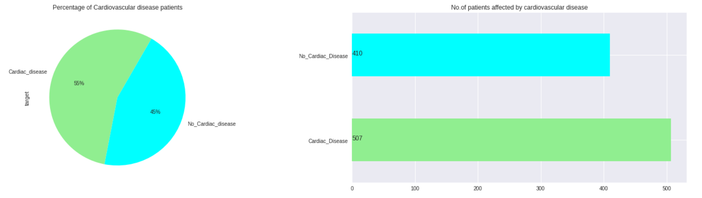

# Statistical Analysis of Cardiovascular Data and Cardiovascular disease prediction using Supervised Machine Learning Model

In the field of medicine, cardiovascular disease or heart disease has been major causes of death. Due to the improvement of people's living standards and the increase of life pressure, the number of people suffering from cardiovascular diseases is also increasing year by year. Cardiovascular disease is considered one of the leading causes of death in our modern age. The aim of this study is to find out the factors which affect cardiovascular disease using statistical data analysis. By using these factors, the research is continued to identify an efficient prediction machine learning model to predict cardiovascular disease with the highest prediction accuracy.

## Data Analysis Steps

Below are the steps to be followed throughout this project,

1. DataCollection

2. Data Preprocessing

    a. Data Cleaning

    b. Feature Selection

3. Exploratory Data Analysis

4. ML Modelling

    a. Train set

    b. Test Set

5. Model Evaluation
## Dataset 

Dataset Link:

https://ieee-dataport.org/open-access/heart-disease-dataset-comprehensive#files

## Dataset Description

S.NO - ATTRIBUTES - DESCRIPTION 

1 - Age - Age in Years (29 to 77)

2 - Sex - Instance of gender (0=Female, 1=Male)

3 - ChestPainType - Types of chest pain (1:typical angina, 2:atypical angina, 3:non-anginal pain, 4:asymptomatic)

4 - RestingBP - Resting blood pressure in mm Hg[94,200]

5 - Cholesterol - Serum Cholesterol in mg/dl[126,564]

6 - FastingBloodSugar - Fasting blood sugar >120 mg/dl(0:False, 1:True)

7 - RestingECG - RestingECG results (0:normal, 1:ST-T Wave abnormality, 2:LV hypertrophy)

8 - MaxHealthRate - Maximum heart rate achieved[71,202]

9 - ExerciseInducedAngina - Exercise induced angina presence (0:No, 1:Yes)

10 - stDepression - ST depression induced by exercise relative to Rest

11 - stSlope - Slope of the peak exercise ST segment (1:up-sloping, 2:flat, 3:down-sloping)

12 - HeartDisease - Presence of heart disease (0:No, 1:Yes)
## Data Preprocessing

https://github.com/ElakkiyaKarthikeyan/Cardiovascular-disease-prediction-using-ML/blob/main/Data%20Cleaning%20and%20Pre-Processing

It is already a cleaned dataset and there are no missing values in the dataset.

Though, it has some duplicate records and need to remove them

## Exploratory Data Analysis

https://github.com/ElakkiyaKarthikeyan/Cardiovascular-disease-prediction-using-ML/blob/main/Exploratory%20Data%20Analysis

The objective of the analysis is to explore the dataset and create a visualization to recognize which features and combinations of features are correlated with the target feature HeartDisease.

** Numerical variable description **

** Categorical variable description **

** HYPOTHESIS **

H1 : The average age of a person who is having cardiovascular disease is higher than the average age of a person who doesn't have a cardiovascular disease.

H2 : The probability of the cardiovascular disease patient heart rate is different than the non-cardiovascular disease patient heart rate.

H3 : There is an association between asymptomatic chest pain type and cardiovascular disease impact.

H4 : The probability of a person having heart disease would increase based on an increase in maximum heart rate, resting BP, cholesterol, and age.

** Feature distribution and relationship among each others **

** 1. Continuous Features Distribution **

** Skewness ** - It is a measurement to check whether the feature is normally distributed or not. If the skewness value is near to 0 then the particular feature is normally distributed.

From the above visualization, looks like all the features are normally distributed except st_depression.

** Target Variable Distribution**

The below figure illustrates the total target variable percentile distribution of patients with cardiovascular disease and patients without cardiovascular disease. This shows that 54% of patients have cardiovascular disease while 46% of patients do not have cardiovascular disease.

** Age with Target Variable **

The minimum age for cardiac patients is above 30 years, and the maximum age is nearby 77 years old. Similarly for non-cardiac patients the minimum age is 27 years old while the maximum age is 76 years. Based on the statistics, the mean age of patients with cardiac disease is 56 years old while the mean age of non-cardiac patients is 50 years old.

** Gender with Target Variable  **

The percentage of females is lower compared to that of males. As a result, one can conclude that males are more exposed to cardiovascular disease than females with 76% and 24%, respectively.

** Maximum Heart Rate with Target **

we can observe that people with heart disease do not have higher heart rate, as having a fast heart rate along with other factors can push a cardiac patient into arrest. The non-cardiac patients have much higher heart rates almost 200 compared to cardiac patient. The cardiac patients maximum heart rate is measured till 185 with a single outlier of 198. Non-cardiac patients have a higher heart rate while cardiac patients reach a maximum heart rate of 180. Therefore, there is a significant difference in the heart rate of people who have cardiovascular disease compared to people who do not have cardiovascular disease.

** Chest-Pain with Target Variable **

The highest type of chest pain in cardiac patients is asymptomatic while the second highest is non-anginal pain.

** Exercise Induced Angina to Target **

Exercise induced angina (EIA) increases the chances of a person having cardiovascular disease. The presence of exercise induced angina in the human body is shown with a numerical value of 1 in the above data visualization.

** St Slope to Target **

The patient's heart rate is determined by the slope of their heart rate. A patient having a flat st_slope would be an indicator of a weak heart or a weak heartbeat and should be diagnosed promptly. A healthy heart would be one that slopes upward and has a fast heartbeat.

** Fasting Blood Sugar to Target **

** Resting ECG to Target Variable **

People with cardiac disease tend to have higher level of st-t wave abnormality, left ventricular hypertrophy when compared with non-cardiac patients.

** Correlation between Variables **

** Distribution of correlation **

## Statistics

https://github.com/ElakkiyaKarthikeyan/Cardiovascular-disease-prediction-using-ML/blob/main/Statistical%20Analysis

** T-Test Hypothesis **

The following data assumptions should be considered for the T-test hypothesis: In other words, they are: independence, continuous data, the variance between the two groups must be equal, and the sampling distribution of the statistic must be normal. There is an unequal variance between the ages of patients with cardiovascular disease and those without cardiovascular disease.

** H1: The average age of a person who is having cardiovascular disease is higher than the average age of a person who doesn't have a cardiovascular disease. **

** RESULT: ** From the above result, we can observe that age distribution of the Non-Cardic patient is shifted downward when compared to the age distribution of cardiac patient.

The maximum cardiovascular disease is affected by the people aged over 55.

Based on the testing, p value is less than 0.05 and the effect size (r) is 0.279 which indicates that our alternate hypothesis true that is the average age of a person is having cardiovascular disease is higher than the person who doesn't have a cardiovascular disease and mostly among the male demographic.

** H2: The probability of the cardiovascular disease patient heart rate is different than the non-cardiovascular disease patient heart rate. **

** RESULT: ** The maximum heart rate to target, we can see that there is a difference between a cardiac patient’s heart rate and a non-cardiac patient's heart rate. The Output 2 shows that the p value is 0.00 and the effect size is 0.353.

This result means that the heart rate of the cardiac patient is significantly different from the non-cardiac patient. 

** Chi-Square Test **

The data assumptions for the Chi-square test entail only a few data assumptions, and it is critical that the data meet them. They are as follows: two variables are categorical or randomly sampled; observations should be independent of each other; no "expected" count in any cell should be zero; and no more than 20% of the cells should have an "expected" count of 5.

** H3: There is an association between asymptomatic chest pain type and cardiovascular disease impact. **

** Result: ** According to the Figure 19 visualisation, in terms of chi-square values, (1) = 193.8514, p < 001, and phi =.52. This shows that there was a significant association between the asymptomatic chest pain type of a person and the chances of having cardiovascular disease.
## Prediction Model Build

https://github.com/ElakkiyaKarthikeyan/Cardiovascular-disease-prediction-using-ML/blob/main/ML%20Modelling%20and%20Evaluation

Machine Learning Model used in this prediction is ** Logistic Regression **

** H4: The probability of a person having heart disease would increase based on an increase in maximum heart rate, resting BP, cholesterol, and age. **

As the target variable is binary variable(nominal variable), the logistic regression model will be helpful to predict the values.

** Step1: ** To get key statistics of variables grouped by target variable

** Step2: ** Create a pairplot to identify the correlation between selected variables

** Step3: ** Lineraity of Independent variable

Cholesterol and cholesterol_int P values is 0.0 which is less than 0.05 so, this feature doesn't the linerarity assumption of logistic regression. Due to this we are removing this variable.

** Step4: ** No High Multicollinearity (only for continuous IVs) 

One way that helps us identify multicollinearity is to create correlation matrix to 
identify high correlation coefficients between ratio/interval IVs.

** Step5: ** Building Logistic Regression model

** Step6: ** Create oddsratio

Coefficients are difficult to interpret in logistic regression models, so we will transform them into odds ratios by calculating the exponent raised to the power of coefficients.

** Step7: ** Confusion Matrix build to calculate the accuracy

According the confusion matrix, the accuracy of this model for this dataset is 69%

**Split the dataset into train and test to train and predict the data **

** Classification report **

## Model Evaluation

Evaluate the model using splitted test data.

The accuracy of the prediction is 73.6%